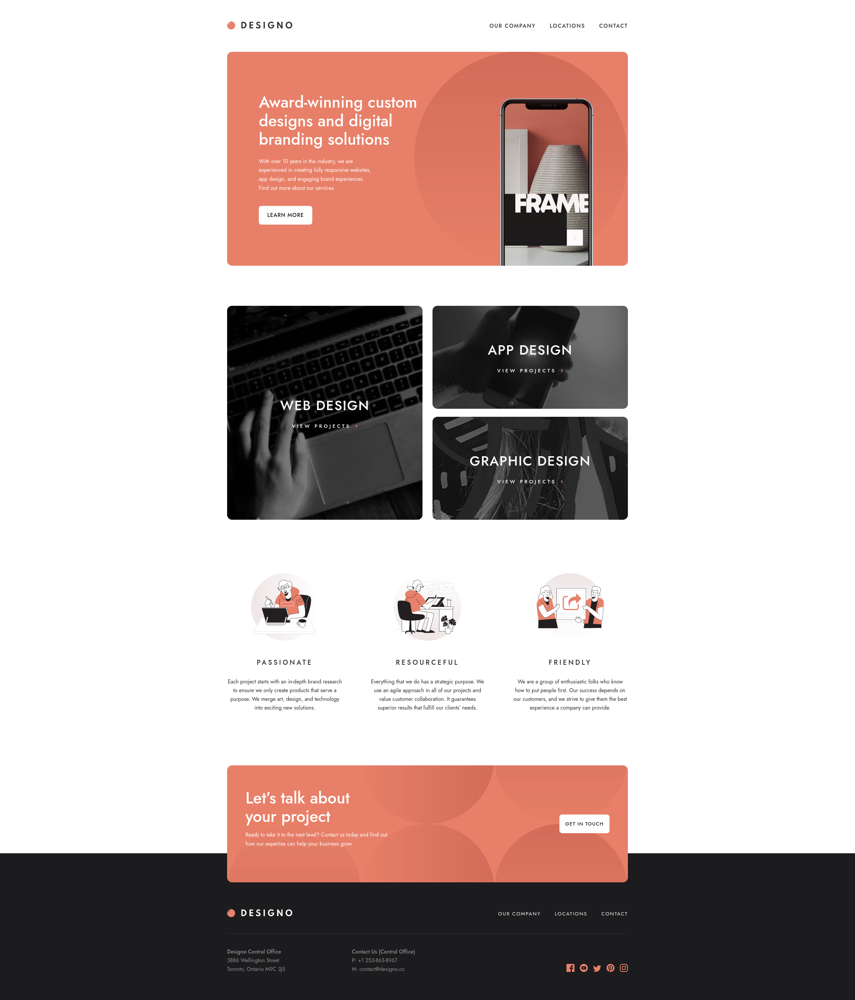

# Frontend Mentor - Designo agency website solution

This is a solution to the [Designo agency website challenge on Frontend Mentor](https://www.frontendmentor.io/challenges/designo-multipage-website-G48K6rfUT). Frontend Mentor challenges help you improve your coding skills by building realistic projects. 

## Table of contents

- [Overview](#overview)
  - [Preview](#preview)
  - [Links](#links)
  - [Built with](#built-with)
  - [Installation](#setup)


## Overview

### Preview



### Links

- Live Site URL: [http://designo-website-amber.vercel.app/](http://designo-website-amber.vercel.app/)

### Built with

- Semantic HTML5 markup
- Mobile-first workflow
- CSS Flexbox & Grid
- Sass preprocessor
- React.js & Next.js
- Typescript

### Setup
```
$ cd designo-website
$ npm install
$ npm start
```